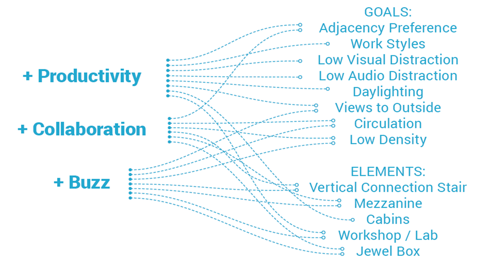
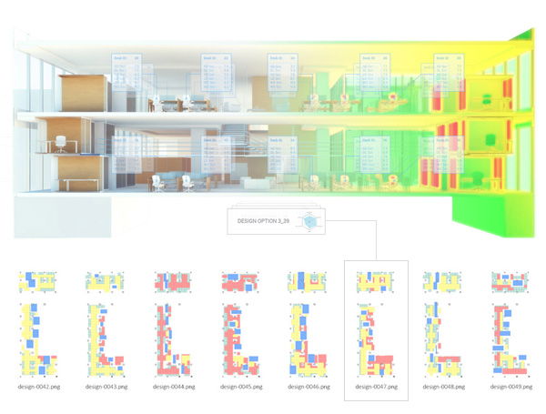
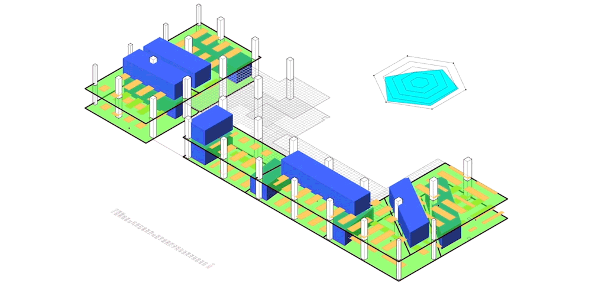

# MaRs Innovation District of Toronto

Let’s look at several examples that illustrate how generative design can help you achieve your design goals.

## Building Design

For the design of the new office and research space in the MaRs Innovation District of Toronto, Autodesk leveraged generative design processes. Starting with high-level goals & constraints and the the power of computation to generate, evaluate, and evolve thousands of design options. The result is a high-performing and novel work environment for Autodesk that would not have been possible to create without this approach.

### Generate

A geometric system was created by the designers that allowed the exploration of multiple configurations of work neighborhoods, amenity spaces and circulation zones - this represents the _`define`_ step of the _`generate`_ phase as defined previously.

The computer used this algorithm, varying its parameters to produce thousands of design options.

### Evaluate

To begin with, information was collected from employees and managers about work styles and location preferences. Based on this data, six primary and measurable goals were defined:

* work style preference
* adjacency preference
* low distraction
* interconnectivity
* daylight
* views to the outside

The designers then created an algorithm to measure how any given floor plan can be measured against each of the stated goals above. Known as _`evaluators`_, these algorithms represents the _`analyse`_ & _`rank`_ stages of the generative process.

After they were formulated, the computer used these algorithms to evaluate each of the designs generated in the previous stage against the defined goals.

### Explore

Once designs have been evaluated, the designers then explored what is often called the _`solution space`_ : the generated designs together with their evaluation results. Taking into account each defined goal, they identified the design that best achieved the defined goals.

## Furniture Design

Looking at a simpler example, let's consider the process of designing a typical, four-legged table.

Using a standard approach, a designer would manually define the height, width, depth & material of the table, and the resulting output would be a single, physical object with a fixed, immutable form. Perhaps the designer tested several distinct sets of dimensions & material combinations and ends up with three or four table prototypes.

In a generative design approach, the designer would instead specify:

* a range of permissible values for each dimension
* a series of available materials and their properties \(such as cost/m²\)
* a set of goals that measure how successful a table design is

### Generate

The designer would use the computer to help him/her generate a series of designs falling within the specified range. Some designs will be short and wide, others will be tall and thin, but each will satisfy the user-defined constraints. This is key, as many designs can be generated very quickly, much more than any human could feasibly examine.

> Let's imagine the computer looked at 20 different values for each of : length, width, height, table/leg material combinations. The resulting solution space would be 20\*20\*20\*20 = 160,000 designs, which is way too many options for a person to reasonably evaluate.

_Above: matrix showing 100 generated table designs, varying width, length and height_

### Evaluate

The next step is to define how the generated designs are evaluated. This is the designer's opportunity to clearly express what the goals of the design are.

_Above: range of table designs \(sizes\), colour-coded based on evaluator function result \(cost\)_

Let's see how different design goals could be expressed in this _`evaluation`_ stage:

| Design goal | Analysis method | Ranking method |
| :--- | :--- | :--- |
| Lowest cost per desk, with minimum 800mm x 600mm size | desk size: at least 800mm x 600mm in size = _`yes/no`_   &  desk cost: area \* material cost/m² = currency _`$`_ value\) | lowest cost first & only options that satisfy area requirements |
| Most profitable  \(largest desk area with lowest material cost\) | desk area = outputs m²  &  unit cost \(area \* material cost/m²\) = currency _`$`_ value | largest area & lowest cost |

The matrix above showcases how you can use this stage in the generative design process to design for wildly different scenarios.

In the first scenario, lowest overall cost is the driving goal, so we can expect small desk sizes & cheap materials, whilst still satisfying the size requirement. This scenario would be relatively simple for humans to replicate, so generative design would only come in handy when the variation or complexity of material costs is high.

For the second scenario, we're optimizing for overall return on investment for each desk, so we can expect larger & more expensive desks than the first one, but that have the best overall ROI. It wouldn't be unexpected for this process to identify a desk with cheap legs & costlier tabletop materials as a viable option.

This second example is a good illustration of using generative design to design for multiple & competing goals, which is very hard for humans to replicate.

_Above: visualizing evaluator function results as a color range_

As you can see, both of these examples follow the same fairly generic process, which is why there are so many possible applications of generative design, in areas as diverse as aviation, automotive and building design, manufacturing, and product design.

