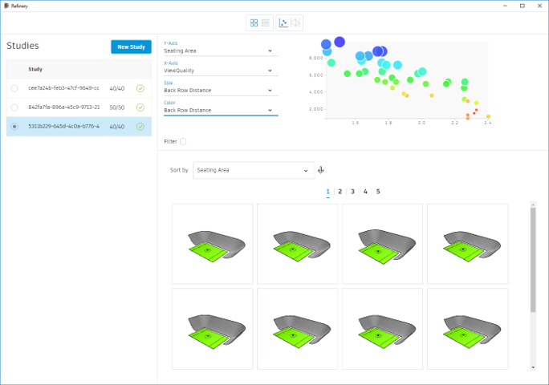

# What is Refinery?

Project Refinery is Autodesk’s latest application for generative design workflows that allows users to explore, evaluate, and optimize their Dynamo designs. Refinery allows users to set multiple \(and sometimes, competing\) design goals, generates a series of solutions, and enables the user to make decisions by automating the creation and evaluation of designs.

The key features of Project Refinery are that it makes it easier to drive a design towards optimality, as it handles all the back-end work of generation and iteration and presents the user with either a single design solution or a collection of optimal solutions that best align with his or her goals.

In short, Refinery enables users to tackle the _`Generate`_, _`Evaluate`_, _`Evolve`_ & _`Explore`_ stages of a generative design process.

As a technical note, Refinery:

* allows a user to leverage Dynamo Package Manager and run custom nodes \(including Python nodes\)
* runs locally on a user’s computer 
* can be accessed from Dynamo for Revit or Dynamo Sandbox
* includes a node to cache Revit or other external data without the need to rely on external processes that could be computationally expensive.

Project Refinery is currently available as a Beta release, as of February 2019: [https://www.autodesk.com/solutions/refinery-beta](https://www.autodesk.com/solutions/refinery-beta)

