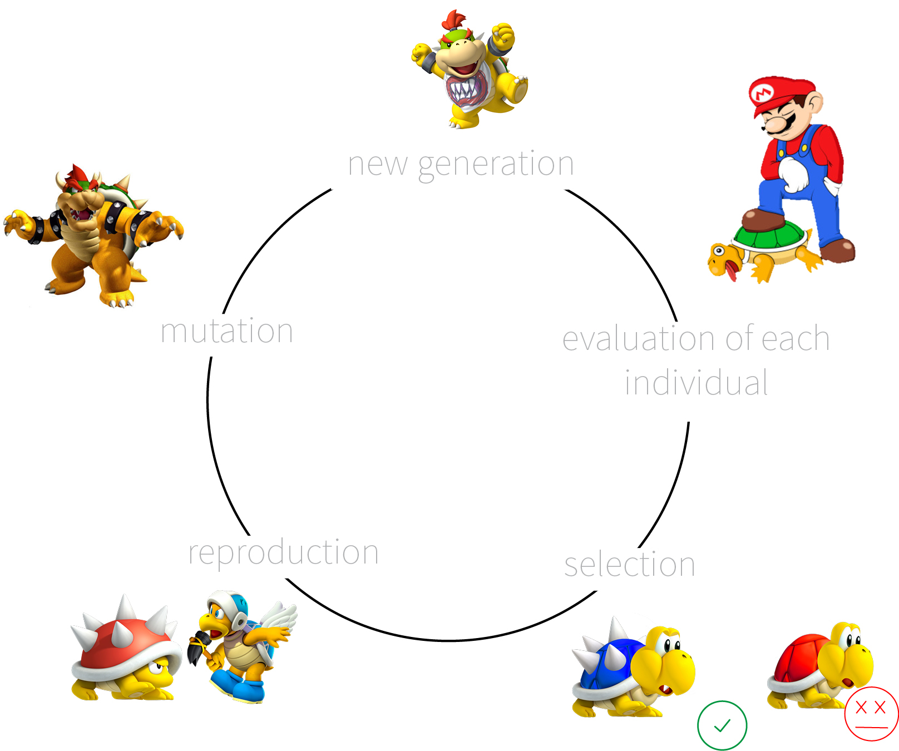

# Genetic Algorithms

### What is a genetic algorithm?

A genetic algorithm - specifically _`NSGA-II`_ \([https://www.iitk.ac.in/kangal/Deb\_NSGA-II.pdf](https://www.iitk.ac.in/kangal/Deb_NSGA-II.pdf)\), is a kind of **optimization algorithm** that is popular in generative design applications. In technical speak, it is an example of an _“adaptive heuristic algorithm”_. You might also hear it referred to as an “evolutionary algorithm”. Genetic algorithms tend to be very useful when your objective function is highly complex, subject to randomness, or is discontinuous.

Genetic algorithms were inspired by the process of evolution by natural selection; in a genetic algorithm the _“fittest”_ individuals \(i.e., potential solutions\) are selected for reproduction and their _“genes”_ are passed on to future generations. When doing generative design we can think of _"genes"_ as the parameters of our model. These are the values that drive our design and will either consist of a single value or a range of acceptable values.

A typical genetic algorithm has five phases:

1. Initialization
2. Evaluation 
3. Selection 
4. Crossover / Reproduction
5. Mutation 

Each of these phases repeats itself over generations, where each generation will use the data generated in the previous. A generation consist of a population which holds a collection of possible solutions.

