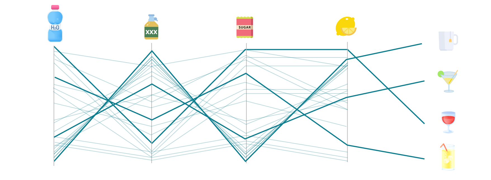
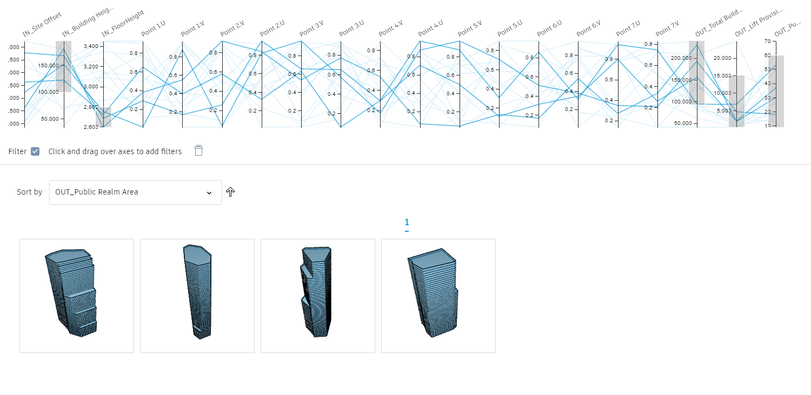

# Optioneering

Optioneering involves creating design options that are not guided by outcomes while they are being created. Optioneering methods can be used to explore a design space quickly and when you might not know what metrics you want to optimize for yet. After performing optioneering, the designer can sort and filter design variants to identify options that are particularly aligned with her design objectives.

Consider the table example in [Section 01-05](https://github.com/martinstacey/RefineryPrimer/tree/8725f75deba64f3e8aa8d5de6aeab84a7ca2b864/01-introduction/01-05_an-example-of-generative-design.md). In the optioneering stage, a designer will browse through their set of designs and select those they like most. Perhaps their selections are particularly eye-catching, perhaps they are ultra-lightweight and practical. Whatever the reason, they select and sort their most favoured options. They continue narrowing down their selections till they're left with just a few. They then mix and match between these options – perhaps one table’s legs aren’t sturdy enough and should be swapped with those of another table that is just too narrow – until they arrive at the final design. It’s this picking and choosing and mixing and matching that is the essence of optioneering. It helps a user find the best design of the bunch.

