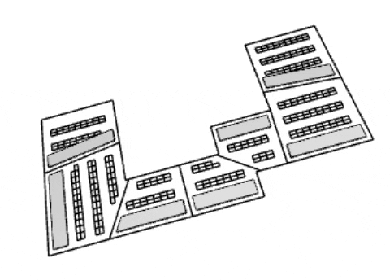

# Workflow 3 - Office Layout

## Description

This graph will generate a series of desk layouts based on a floor plate and neighborhood boundaries. Desks are placed in rows either horizontally or vertically, alongside a reserved space for amenities such as breakout spaces, or tea points. The intention is to find a solution that maximizes the number of desks the layouts can fit in whilst maintaining a high area for amenities.

_All sample files for this example can be found in the_ [_`7-00_sample_files`_](https://github.com/DynamoDS/RefineryPrimer/tree/master/07-workflows/07-00_sample_files) _folder in the Github repository_

## Static inputs

| Name | Description |
| :--- | :--- |
| Floor plate | Select the floor geometry |
| Neighborhood boundaries | Select the neighborhood boundaries \(model curves\) |
| Desk width | Width of the office desk \(mm\) |
| Desk depth | Depth of the office desk \(mm\) |
| Back to back tolerance | Distance between two desks where people would be sat back to back \(mm\) |

## Variable inputs

| Name | Description |
| :--- | :--- |
| Boundary start points | The movement of the start point of each of the neighborhood boundaries along the floor boundary |
| Boundary end points | The movement of the end point of each of the neighborhood boundaries along the floor boundary |

## Functions

The script is made up of a series of functions, which are divided into groups inside the graph. Each group has a name and a short description, where the name indicates the type of function that is being run and the description explains in more detail the process. This graph extracts the underlying surface from the floor geometry and builds perimeter curves. The neighborhood boundaries sit along these perimeter curves and can move within a tolerance defined by the script. This movement causes the neighborhood sizes to change providing new floor plates and new layouts respectively. The amenity space is defined as an offset space based from the longest curve and the desks then occupy the remaining space in the most efficient way.

## Visualization

When geometry is created in Dynamo, often other geometry is needed to facilitate the overall process. To ensure the geometry displayed shows the final geometric output, all unnecessary geometry has been switched off. Any nodes with the preview switched off will not display the output visually in Refinery. In this case, only the perimeter lines of the floor plate, the neighborhood boundaries, amenity spaces and office desks will be visible. The amenity spaces are shown in grey to differentiate them from the rest of the geometry.

## Evaluators

| Name | Description |
| :--- | :--- |
| Amenity space area | The total area occupied by the amenity spaces |
| Number of desks | The total number of office desks |

## Refinery

Designers can spend hours laying out repetitive areas such as offices an toilets. By creating an algorithm with clear goals, maximum number of desks and maximum amenity space, Refinery can be used as the solver to arrive at the best solution quicker.

## Results

Once Refinery has completed, the results can be explored through the available tables and graphs   
 The image below shows an example output from a randomized study based on 35 solutions.

